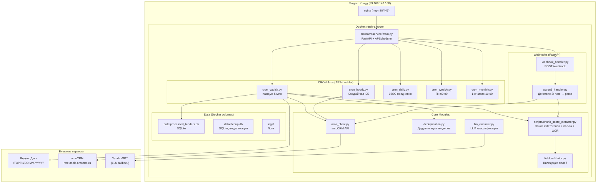
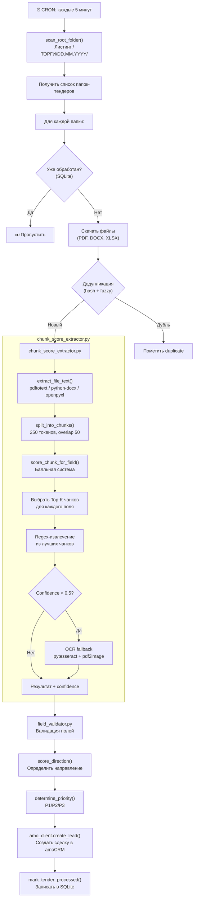

# RETEK amoCRM — Архитектура проекта

> Этот документ — главная точка входа для понимания системы.
> Всегда придерживайся этой схемы при внесении изменений.

---

## 1. Общая архитектура (High-Level)



---

## 2. Pipeline распознавания тендеров (cron_yadisk)



---

## 3. Cron-расписание (APScheduler)

| Job ID | Модуль | Расписание | Описание |
|--------|--------|-----------|----------|
| `yadisk_scan` | `cron_yadisk.py` | **Каждые 5 минут** | Сканирование /ТОРГИ/ на Яндекс.Диске, распознавание новых тендеров |
| `hourly_control` | `cron_hourly.py` | Каждый час :05 | Контроль сделок Р1/Р2, проверка дедлайнов, эскалация |
| `daily_archive` | `cron_daily.py` | 02:00 ежедневно | Архивация старых сделок |
| `weekly_control` | `cron_weekly.py` | Понедельник 09:00 | Контроль зависших сделок |
| `monthly_revision` | `cron_monthly.py` | 1-е число 10:00 | Ревизия архива |

---

## 4. Иерархия файлов проекта

```
Manus_AmoCRM_RETEK/
├── .env                          # Конфигурация (токены, ключи)
├── Dockerfile                    # Dev Dockerfile
├── requirements.txt              # Базовые зависимости
│
├── deploy/                       # PRODUCTION DEPLOYMENT
│   ├── Dockerfile                # Prod Dockerfile (python:3.11-slim + tesseract + poppler)
│   ├── docker-compose.yml        # Docker Compose (app + nginx + certbot)
│   ├── requirements-deploy.txt   # Доп. зависимости (chromadb, pdf2image, pytesseract)
│   └── nginx/                    # Конфиг nginx
│
├── src/
│   ├── microservice/             # ОСНОВНОЙ СЕРВИС (запускается в Docker)
│   │   ├── main.py              # FastAPI app + APScheduler setup
│   │   ├── config.py            # Конфигурация из .env
│   │   ├── cron_yadisk.py       # ⭐ Главный pipeline: YaDisk → Parse → amoCRM
│   │   ├── cron_hourly.py       # Ежечасный контроль Р1/Р2
│   │   ├── cron_daily.py        # Ежедневная архивация
│   │   ├── cron_weekly.py       # Еженедельный контроль
│   │   ├── cron_monthly.py      # Ежемесячная ревизия
│   │   ├── cron_backup.py       # Бэкап данных
│   │   ├── amo_client.py        # amoCRM REST API клиент
│   │   ├── webhook_handler.py   # Обработка вебхуков от amoCRM
│   │   ├── action3_handler.py   # Действие 3: note → распознавание
│   │   ├── deduplication.py     # Дедупликация (hash + fuzzy match)
│   │   ├── field_validator.py   # Валидация извлечённых полей
│   │   └── llm_classifier.py   # LLM-классификация (YandexGPT)
│   │
│   ├── domain/                   # Доменная модель (DDD)
│   │   ├── models.py            # Tender, Lead, etc.
│   │   ├── enums.py             # Direction, Priority, Status
│   │   ├── rules.py             # Бизнес-правила
│   │   └── notes.py             # Шаблоны заметок
│   │
│   ├── application/              # Сервисный слой
│   │   ├── cron_service.py
│   │   ├── webhook_service.py
│   │   ├── action3_service.py
│   │   └── deduplication_service.py
│   │
│   ├── infrastructure/           # Инфраструктурные клиенты
│   │   ├── amocrm_client.py
│   │   ├── llm_client.py
│   │   └── yadisk_client.py
│   │
│   └── api/                      # REST API слой
│       ├── main.py
│       ├── routes.py
│       └── dependencies.py
│
├── scripts/                      # УТИЛИТЫ И МОДУЛИ
│   ├── chunk_score_extractor.py  # ⭐ Чанки + баллы + OCR (250 токенов)
│   ├── extract_and_classify.py   # Старый regex-парсер (legacy)
│   ├── rag_indexer.py            # RAG индексация (ChromaDB)
│   ├── rag_search.py             # RAG поиск
│   ├── pipeline_tender.py        # Pipeline обработки тендера
│   └── benchmark_extraction.py   # Бенчмарк извлечения
│
├── tests/                        # ТЕСТЫ (pytest)
│   ├── test_cron_yadisk.py
│   ├── test_chunk_score_extractor.py  # ← НОВЫЙ
│   ├── test_deduplication_deep.py
│   ├── test_amo_client.py
│   └── ... (715+ тестов)
│
├── data/                         # ДАННЫЕ (Docker volume)
│   ├── processed_tenders.db      # SQLite: обработанные тендеры
│   └── dedup.db                  # SQLite: дедупликация
│
├── docs/                         # ДОКУМЕНТАЦИЯ
│   ├── ARCHITECTURE.md           # ← ЭТОТ ФАЙЛ
│   ├── FAQ_PIPELINE.md           # FAQ для новых сессий
│   ├── CONTEXT_FULL.md           # Полный контекст проекта
│   ├── SYSTEM_LOGIC_AND_ARCHITECTURE.md
│   └── amocrm_fields_and_logic.md
│
└── AGENTS.md                     # Инструкции для AI-агентов
```

---

## 5. Гарантия автономности

Система **полностью автономна** и работает без вмешательства:

1. **Docker `restart: always`** — контейнер перезапускается при падении и после перезагрузки сервера
2. **Docker systemd** — Docker daemon включён в автозапуск (`systemctl enable docker`)
3. **APScheduler** — встроенный планировщик внутри приложения, не зависит от системного cron
4. **Health check** — Docker проверяет `/health` каждые 30 секунд, перезапускает при 3 неудачах
5. **Логирование** — все действия пишутся в `docker logs retek-amocrm`

### Что происходит при перезагрузке сервера:
```
Сервер загружается → Docker запускается (systemd) → Контейнер retek-amocrm стартует (restart: always)
→ FastAPI + APScheduler инициализируются → Cron jobs начинают работать через 5 минут
```

---

## 6. Внешние зависимости

| Сервис | Назначение | Конфигурация |
|--------|-----------|-------------|
| Яндекс.Диск | Хранение тендерных документов | `YADISK_TOKEN` в .env |
| amoCRM | CRM для сделок | `AMO_*` переменные в .env |
| YandexGPT | LLM-классификация (опционально) | `YANDEX_GPT_*` в .env |

---

## 7. Правила внесения изменений

1. **Каждое изменение** → тесты → проверка → отдельная ветка
2. **Глобальные изменения архитектуры** → новая ветка `feature/описание_YYYY-MM-DD_HHMM`
3. **Обновить эту схему** при изменении структуры
4. **Не ломать cron** — система должна оставаться активной 24/7
5. **Тестировать на сервере** перед мержем в main
