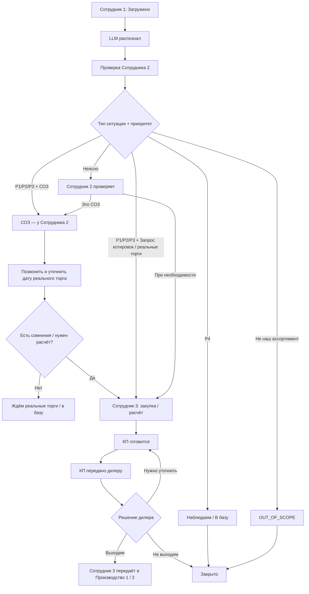

# Mermaid pipeline — новая схема процесса


```mermaid
flowchart TD
    A[Сотрудник 1: Загружено] --> B[LLM распознал]
    B --> C[Проверка Сотрудника 2]

    C --> D{Тип ситуации + приоритет}

    D -->|Р1/Р2/Р3 + СОЗ| E[СОЗ — у Сотрудника 2]
    E --> E1[Позвонить и уточнить дату реального торга]
    E1 --> E2{Есть сомнения / нужен расчёт?}
    E2 -->|Нет| E3[Ждём реальные торги / в базу]
    E2 -->|Да| F[Передано Сотруднику 3]

    D -->|Р1/Р2/Р3 + Запрос котировок / реальные торги| F[Сотрудник 3: закупка / расчёт]
    F --> G[КП готовится]
    G --> H[КП передано дилеру]
    H --> I{Решение дилера}
    I -->|Выходим| J[Сотрудник 3 передаёт в Производство 1 / 2]
    I -->|Не выходим| Z[Закрыто]
    I -->|Нужно уточнить| G

    D -->|Р4| K[Наблюдаем / В базу]
    K --> Z

    D -->|Не наш ассортимент| L[OUT_OF_SCOPE]
    L --> Z

    D -->|Неясно| M[Сотрудник 2 проверяет]
    M -->|При необходимости| F
    M -->|Это СОЗ| E
```
```
