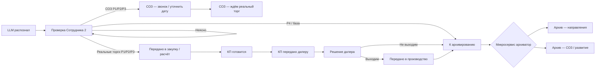

# amoCRM active pipeline

```mermaid
flowchart LR
    A[LLM распознал] --> B[Проверка Сотрудника 2]
    B -->|СОЗ Р1/Р2/Р3| C[СОЗ — звонок / уточнить дату]
    C --> D[СОЗ — ждём реальный торг]
    B -->|Реальные торги Р1/Р2/Р3| E[Передано в закупку / расчёт]
    B -->|Неясно| B
    B -->|Р4 / база| J[К архивированию]
    E --> F[КП готовится]
    F --> G[КП передано дилеру]
    G --> H[Решение дилера]
    H -->|Выходим| I[Передано в производство]
    H -->|Не выходим| J
    I --> J[К архивированию]
    J --> K{Микросервис архиватор}
    K --> L[Архив — направления]
    K --> M[Архив — СОЗ / развитие]
```
