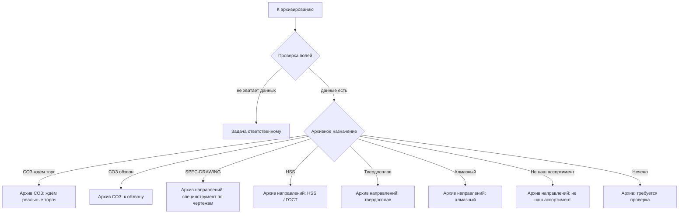

# Archive routing

```mermaid
flowchart TD
    A[К архивированию] --> B{Проверка полей}
    B -->|не хватает данных| C[Задача ответственному]
    B -->|данные есть| D{Архивное назначение}
    D -->|СОЗ ждём торг| E[Архив СОЗ: ждём реальные торги]
    D -->|СОЗ обзвон| F[Архив СОЗ: к обзвону]
    D -->|SPEC-DRAWING| G[Архив направлений: специнструмент по чертежам]
    D -->|HSS| H[Архив направлений: HSS / ГОСТ]
    D -->|Твердосплав| I[Архив направлений: твердосплав]
    D -->|Алмазный| J[Архив направлений: алмазный]
    D -->|Не наш ассортимент| K[Архив направлений: не наш ассортимент]
    D -->|Неясно| L[Архив: требуется проверка]
```
